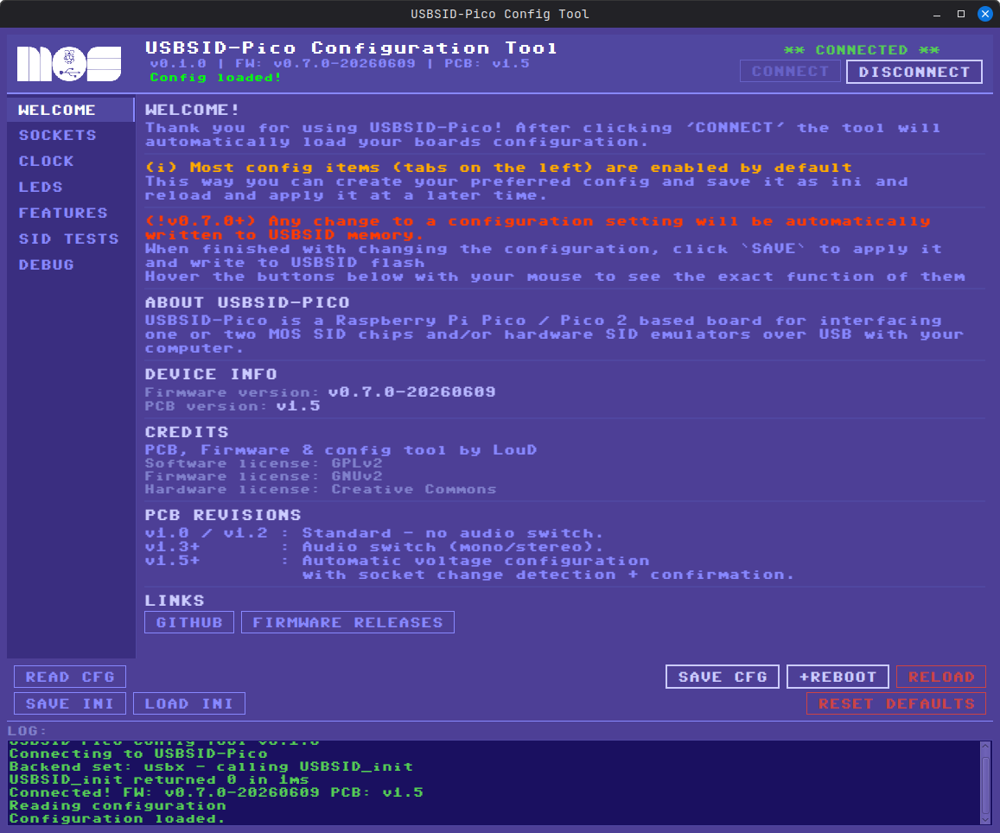
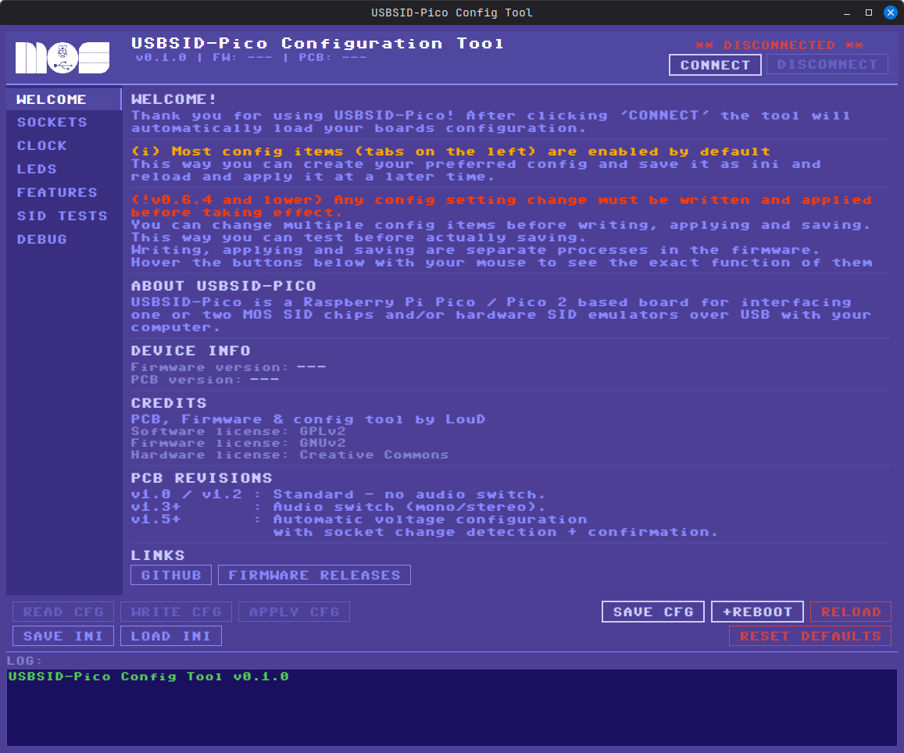

# USBSID-Configtool

This repo contains the graphical configuration tool for USBSID-Pico.  
It exists as supplement and next to the [command line config](https://github.com/LouDnl/USBSID-Pico/tree/master/examples/config-tool) tool and [web configtool](https://usbsid.loudai.nl).  

The Configtool is written in [Clojure](https://www.clojure.org) which is a lisp that runs on top of Java. It's really neat, go check it out!  
It also uses [cljfx](https://github.com/cljfx/cljfx) which is an extensive wrapper around JavaFX for Clojure.  
To communicate with USBSID-Pico it uses the [Java driver](https://github.com/LouDnl/USBSID-Pico-driver/tree/master/java/usbsid-usb-driver-library-java) I made which is separately available, but not needed for the releases (it's included).  
The driver runs on top of [javax.usb](https://javax-usb.sourceforge.net/) or [usb4java](https://github.com/usb4java/usb4java) depending on the platform you are on!  

## Requirements
The minimum USBSID-Pico firmware version to be able to use the config tool is `0.5.0-BETA`.  
For the best experience version `0.7.0-BETA` is advised!  

Due to breaking changes in the way the socket values are handled, I advise upgrading to the latest firmware version.  
These changes are visual only for pcb v1.3 and lower, but required for pcb v1.4 and higher due to voltage configuration.  

## Installation
Download from https://github.com/LouD/USBSID-Configtool/releases

## Supported platforms
All including (driver/javafx) formats:  
Linux -> `USBSID-Configtool-x.x.x-x86_64.AppImage`  
Linux -> `USBSID-Configtool-x.x.x-linux.zip`  
Windows -> `USBSID-Configtool-x.x.x-windows.msi`  
MacOs Apple silicon -> `USBSID-Configtool-x.x.x-macos-aarch64.dmg`  
MacOs Intel -> `USBSID-Configtool-x.x.x-macos-x86_64.dmg`  

Java JAR file without driver and javafx:  
All platforms (Java JAR) -> `usbsid-configtool-x.x.x.jar` + `run.sh` or `run.bat` 

## Options
- Pre defined socket configurations
- Manual socket configuration
- Socket Chip/SID auto detect
- Clock configuration
- LED configuration
- PCB related feature configuration
- Save your favorite configs to an INI file
- Import your favorite configs back in and write them to USBSID-Pico
  * Fully compatible with `cfg_usbsid` INI files

## In development
- Clone chip configuration screens for SIDEMU, FPGASID, SKPICO, PDSID, ARMSID, etc!
- Send SID files to the onboard SID player (Pico2 only!)
- Local player, maybe!?
- Any requests?

## Screenshots
  

### Bugs
- Many, probably! Please report any via the issues page!

## Fonts
Font used is `C64 TrueType v1.2.1/Style` by [style64](https://style64.org/c64-truetype)  
The font is implemented according to their [license statement](https://style64.org/c64-truetype/license)  

## License
Copyright © 2026 LouD  
  
Distributed under the [Eclipse Public License 2.0](https://www.eclipse.org/legal/epl-2.0)
